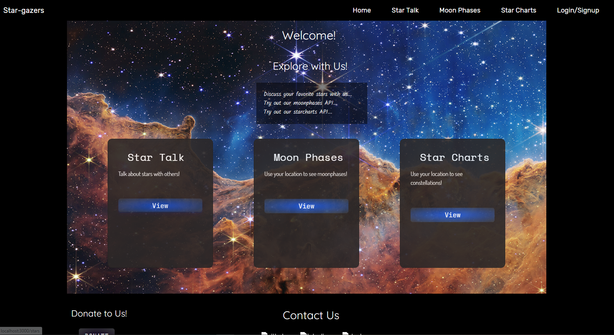
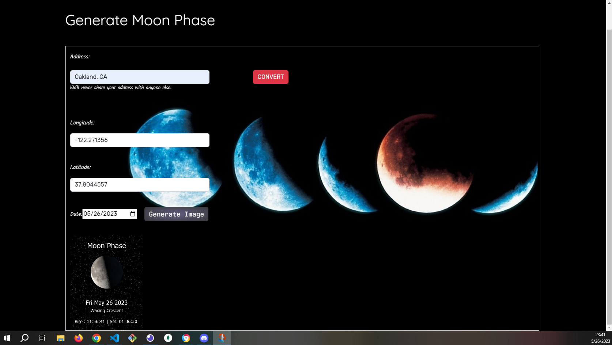

# star-grazers

  

## Description
Star Gazers is a group project that utilizes the full MERN stack to deliver an app that lets users explore the night sky via stars, constellations, moon phase calendars and other celestial events. A profile and discussions posts let users connect and share the wonder of the universe in a community.

## Table of Contents
  * [Installation](#installation)
  * [Usage](#usage)
  * [Tests](#tests)
  * [Contributing](#contributing)
  * [Credits](#credits)
  * [License](#license)
  
## Installation
  
  In the terminal, run: npm init, npm i, npm run develop
  
## Usage
  Dependencies required:
  * "@testing-library/jest-dom": "^5.16.5",
  * "@testing-library/react": "^13.4.0",
  * "@testing-library/user-event": "^13.5.0"
  * "axios": "^1.4.0",
  * "node-geocoder": "^4.2.0",
  * "react": "^18.2.0",
  * "react-dom": "^18.2.0",
  * "react-scripts": "5.0.1",
  * "web-vitals": "^2.1.4"
   devDependencies required:
  * "concurrently": "^5.1.0"

  Client Dependencies:
  * "@apollo/client": "^3.5.8",
  * "@testing-library/jest-dom": "^5.11.4",
  * "@testing-library/react": "^11.1.0",
  * "@testing-library/user-event": "^12.1.10",
  * "graphql": "^15.4.0",
  * "jwt-decode": "^3.1.2",
  * "react": "^17.0.1",
  * "react-dom": "^17.0.1",
  * "react-router-dom": "^6.2.1",
  * "react-scripts": "5.0.1",
  * "web-vitals": "^0.2.4",
  * "bootstrap": "^5.2.3",
  * "react-bootstrap": "^2.7.0"

  Server Dependencies:
  * "apollo-server-express": "^3.6.2",
  * "bcrypt": "^5.0.0",
  * "express": "^4.17.2",
  * "graphql": "^16.3.0",
  * "jsonwebtoken": "^8.5.1",
  * "mongoose": "^7.0.2",
  * "node-geocoder": "^4.2.0"
   devDependencies:
  * "nodemon": "^2.0.3"

  Scripts used (./):
  * "start": "node server/server.js",
  * "develop": "concurrently \"cd server && npm run watch\" \"cd client && npm start\"",
  * "install": "cd server && npm i && cd ../client && npm i",
  * "seed": "cd server && npm run seed",
  * "build": "cd client && npm run build"

  Scripts used (./server):
  * "start": "node server.js",
  * "watch": "nodemon",
  * "seed": "node seeders/seed.js"

  Screenshots of project in action:
  Home Screen
  

Moon Phase Viewer
  
  
## Tests
  N/A

  
## Contributing

## Credits

* https://github.com/14chenj92
* https://github.com/saf1ya-c0d3z
* https://github.com/trichau0206, trichauphuoc@gmail.com

## License:

MIT

Copyright 2023

        Permission is hereby granted, free of charge, to any person 
        obtaining a copy of this software and associated documentation 
        files (the “Software”), to deal in the Software without restriction, 
        including without limitation the rights to use, copy, modify, 
        merge, publish, distribute, sublicense, and/or sell copies of 
        the Software, and to permit persons to whom the Software is 
        furnished to do so.
        
        THE SOFTWARE IS PROVIDED “AS IS”, WITHOUT WARRANTY OF ANY KIND, 
        EXPRESS OR IMPLIED, INCLUDING BUT NOT LIMITED TO THE WARRANTIES 
        OF MERCHANTABILITY, FITNESS FOR A PARTICULAR PURPOSE AND 
        NONINFRINGEMENT. IN NO EVENT SHALL THE AUTHORS OR COPYRIGHT 
        HOLDERS BE LIABLE FOR ANY CLAIM, DAMAGES OR OTHER LIABILITY, 
        WHETHER IN AN ACTION OF CONTRACT, TORT OR OTHERWISE, ARISING 
        FROM, OUT OF OR IN CONNECTION WITH THE SOFTWARE OR THE USE OR 
        OTHER DEALINGS IN THE SOFTWARE.

## Badges

## Contact Me
  * GitHub: https://github.com/maxr-e
  * Email: maxroyal.eisenberg@gmail.com

